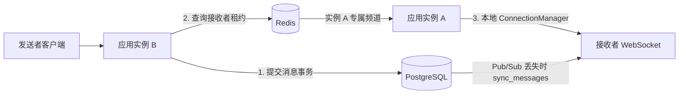

# Redis 多实例实时路由

PostgreSQL 是消息的可靠来源，Redis 只负责在线实例发现和低延迟实时事件。每个应用实例
只保存自己进程内的 WebSocket 对象，不会把连接对象序列化到 Redis。

## 跨实例消息路径



如果发送者和接收者都连接在实例 B，网关直接使用本地 `ConnectionManager`，不经过
Redis。只有本地找不到接收者时才查询在线租约并发布到目标实例频道。

消息始终先提交数据库再尝试实时路由。Redis 不可用、目标订阅断开或进程崩溃都不会
回滚消息；客户端通过 Issue 19 的稳定位置和 `sync_messages` 恢复缺失历史。

## 最小内部协议

目标频道格式：

```text
<prefix>:instance:<instance_id>
```

事件示例：

```json
{
  "version": 1,
  "event_type": "message.deliver",
  "event_id": "336eb7bb-0b19-44e9-80fd-50bd517115fa",
  "source_instance_id": "app-b",
  "target_user_id": "user-b",
  "payload": {
    "type": "message",
    "server_message_id": "e6935df2-343f-4915-bcb7-fbd45891fd60",
    "client_message_id": "5cbe59a7-1c45-4dd9-9302-d9eb2586bb6b",
    "conversation_id": "31487468-dd7c-4de9-ac2b-fd5b979da2b8",
    "sender_id": "user-a",
    "recipient_id": "user-b",
    "content": "Hello",
    "sent_at": "2026-09-06T08:00:00Z"
  }
}
```

Pydantic 会拒绝未知字段、错误版本和不合法消息字段。目标实例使用载荷中的
`server_message_id` 在有界内存缓存中短期去重，避免同一领域消息以不同内部事件重试
时重复推送。`event_id` 用于内部流程关联。客户端仍必须按
`server_message_id` 幂等保存；实例重启后内存去重缓存会消失，系统不承诺网络层恰好
一次。

发送方 `accepted.push_status` 新增 `routed`，表示事件已经发布到目标实例频道，不表示
接收客户端已经处理，更不表示用户已读。

## 在线状态租约

在线键格式：

```text
<prefix>:presence:<user_id> = <instance_id>, TTL=30秒
```

- 建立本地 WebSocket 后写入租约。
- 默认每 10 秒刷新仍属于当前实例的租约。
- 新实例登录同一用户时直接接管租约。
- Lua 比较后刷新/删除，旧实例不能覆盖或删除新实例租约。
- 正常断开尽力删除；Redis 不可用或进程崩溃时依靠 TTL 最终清理。

租约不是永久在线记录。没有 TTL 的键在进程崩溃后无人删除，会让发送者长期把消息
路由到不存在的实例。

当前跨实例重复登录不会立即关闭旧实例上的 WebSocket，但新租约胜出，后续实时消息只
路由到新实例。要实现多设备或全局踢旧连接，需要另行定义连接会话模型。

## 订阅恢复和投递语义

每个实例启动一个订阅监督任务和一个租约刷新任务：

- Pub/Sub 连接断开后按配置周期重新订阅实例频道。
- Redis 操作有短超时，故障不会无限阻塞消息应用服务。
- 应用关闭时先删除本实例租约，再取消后台任务并关闭 Redis 连接池。
- Redis 客户端在应用生命周期内共享，不按请求反复创建连接池。

Redis Pub/Sub 是至多一次：订阅者离线期间的事件不会保存或重放。Compose 明确关闭
Redis RDB 和 AOF，因为本项目没有把 Redis 当作聊天数据库或离线队列。

`/health/ready` 仍以数据库和迁移版本为准。Redis 故障会把实时能力降级为数据库同步，
不会把实例整体摘流，否则离线客户端反而无法使用可靠补偿接口。

## 配置

删除 `REDIS_URL` 即保持原来的单实例本地模式。启用多实例时：

```dotenv
REDIS_URL=redis://127.0.0.1:6379/0
INSTANCE_ID=app-a
REDIS_PRESENCE_LEASE_SECONDS=30
REDIS_PRESENCE_REFRESH_SECONDS=10
REDIS_SUBSCRIBER_RETRY_SECONDS=1
REDIS_OPERATION_TIMEOUT_SECONDS=1
REDIS_MAX_CONNECTIONS=20
REDIS_CHANNEL_PREFIX=bidirectional-chat
REDIS_RECENT_EVENT_TTL_SECONDS=60
REDIS_RECENT_EVENT_LIMIT=10000
```

刷新周期必须严格短于租约时间，否则应用在启动配置校验阶段失败。`REDIS_URL` 使用
`SecretStr`，不会出现在配置展示或结构化日志中。

## 两实例验收

```bash
docker compose --profile multi-instance up --build -d --wait
uv run python -m examples.containerSmokeTest \
  --base-url http://127.0.0.1:8000 \
  --secondary-base-url http://127.0.0.1:8001
```

脚本把接收者连接到 `app-b`、发送者连接到 `app-a`，并要求发送方看到
`push_status=routed`、接收方实时收到相同 `server_message_id`。

## Redis 故障补偿演练

保持 PostgreSQL 和两个应用在线：

```bash
docker compose stop redis
uv run python -m examples.redisOutageSmokeTest \
  --sender-base-url http://127.0.0.1:8000 \
  --recipient-base-url http://127.0.0.1:8001
docker compose start redis
```

故障脚本验证实时路由返回 `failed`，但消息已经提交 PostgreSQL；接收者随后连接另一个
实例并通过 `sync_messages` 取回消息。Redis 恢复后订阅任务自动重连，不需要重启应用。

## 边界

- Redis 不保存消息历史，不参与消息数据库事务。
- Pub/Sub 不提供确认、重放或恰好一次。
- 在线租约只说明最近由哪个实例续期，不等于用户一定能成功接收下一帧。
- PostgreSQL 支持多个应用进程访问数据，但真正多副本部署仍需负载均衡、优雅摘流和
  更完整的容量验证。
- Compose 的 Redis 端口只绑定 `127.0.0.1`，适合本地开发；跨主机部署必须配置 TLS、
  ACL/密码和受信网络，因为瞬时事件载荷包含聊天正文。
